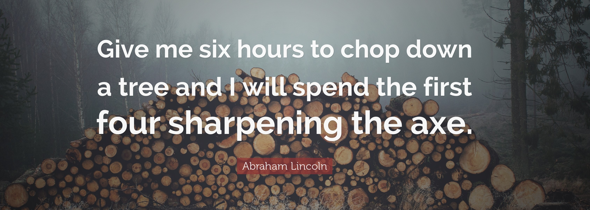
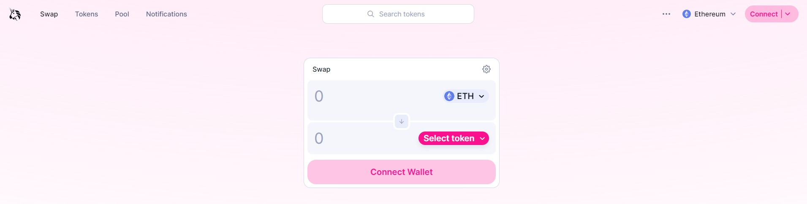
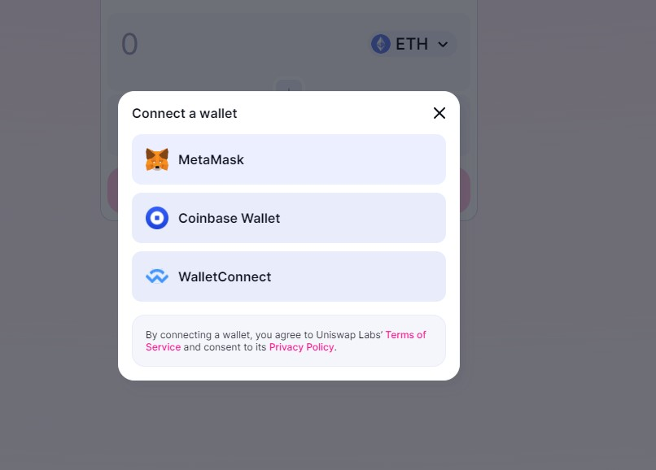
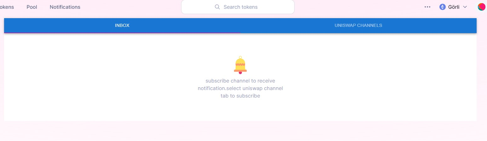
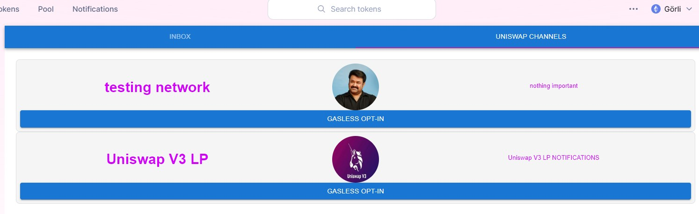
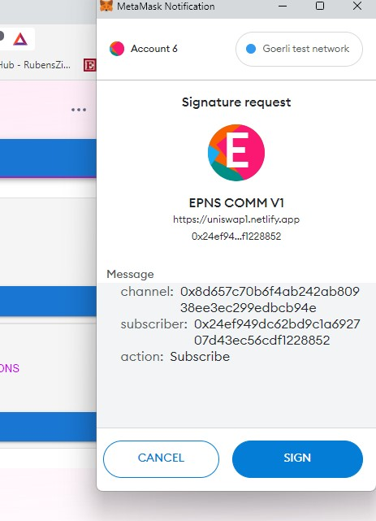

# UNISWAP FORK INTEGRATED WITH PUSH PROTOCOL

## This app has intergrated push protocol to receive web3 notification in the frontend.



**I spent most of my time learning about the push protocol and Uniswap before starting development. This approach was very useful when I started integrating the push protocol into Uniswap.**

# Documentation

## For Frontend Users

Users can acces Push protocol integrated website using this link: [Uinswap](https://uniswap1.netlify.app/#/swap)

Step 1 : **Access the website using the above link provided and you can see tabs like**


<br>

Step 2 :**The next step is to connect your wallet to the uinswap dapp using connect button and select the wallet you have.**


<br>

Step 3 : **To view notifications, the user must select the Notifications tab in the DApp. There you will find the Inbox and Uniswap Channel tabs. The Inbox tab contains notifications received and the Uniswap Channel tab contains channels related to Uniswap.**


<br>
Step 4:

**To receive notifications, users must first subscribe to the channel. To subscribe to a channel, you must select the Uniswap Channels tab. Here you can find channels related to Uniswap. To subscribe, click the GASLESS OPT-IN button and sign the message. There are no transaction fees for subscribing.**



Step 5: **After subscribing to the channel users can view the notifications from the subscribed channel in the inbox tab.**

These are the steps required for a frontend user to receive notifications in a DApp.

## For developers

**Developers can easily add new channels by adding the channel details to the channelsinfo file in the constants folder**

```
.
├── ...
├── src
     ├── constants
              ├── channelinfo.tsx #Edit this file and add channel details according to the format in the file.

```

## Implementation details

### Resources/References

[Push Protocol Developer Docs](https://docs.push.org/developers/) <br>
[How to integrate a frontend - Push Protocol](https://docs.push.org/developers/developer-guides/integrating-on-frontend) <br>
[push-for-hackers repo](https://github.com/ethereum-push-notification-service/push-for-hackers) <br>
[Web3 notification integrating tutorial by Harsh Rajat](https://www.youtube.com/watch?v=ZCgl1XGD6yM) <br>

**PUSH notifications are integrated into Uniswap fortend using the PUSH Restful API (Best for Frontend Integration).**

step 1: **For frontend integration we need to get user notifications and channel subscriptions. For that we need PUSH SDK**

```
# install the sdk "restapi" package & its peer dependencies in your app

yarn add @pushprotocol/restapi ethers

# or,

npm install @pushprotocol/restapi ethers
```
